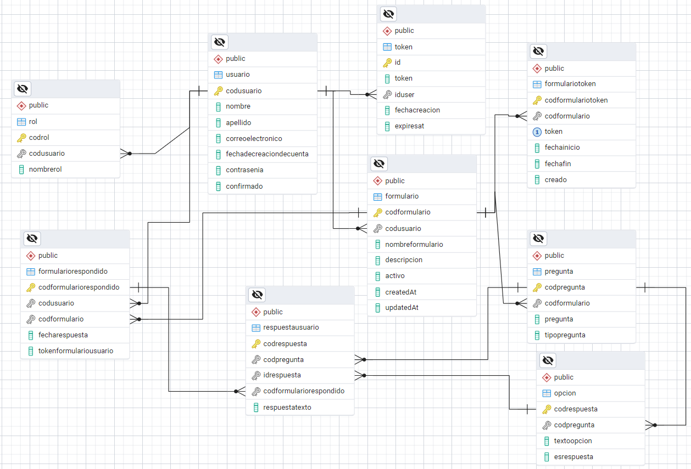

# ezzForm

ezzForm es una aplicación web diseñada para facilitar la creación de formularios personalizados de manera intuitiva. Los usuarios pueden registrarse, iniciar sesión y gestionar sus formularios de forma rápida y eficiente.

## Características

-   **Página Principal**: Navega por la información principal de la plataforma y sus beneficios.
-   **Crear Cuenta**: Regístrate para acceder a la plataforma y comenzar a crear formularios.
-   **Iniciar Sesión**: Accede con tu cuenta para gestionar y crear formularios personalizados.
-   **Gestión de Formularios**:
    -   Crear un nuevo formulario.
    -   Modificar formularios existentes.
    -   Visualizar formularios creados previamente.

## Diseño de la base de datos



## Instalación

Sigue estos pasos para instalar y ejecutar ezzForm en tu entorno local.

1. Clona el repositorio:
    ```bash
    git clone https://github.com/polycyllo/PROYECTO-PROGRAMACION-WEB.git
    ```
2. Navega a la carpeta del proyecto:
    ```bash
    cd PROYECTO-PROGRAMACION-WEB
    ```
3. Instala las dependencias:
    ```bash
    npm install
    ```
4. Crea una archivo .env
   y coloca
   VITE_APIT_URL=http://localhost:4000 (depende el puerto que se designo al backend)

5. Ve a la rama Backend y realiza lo mismo, clona la rama y ejecuta npm i

6. crea un archivo .env en el backend
   y pega

    DB_NAME=ezzForm
    DB_USER=postgres
    DB_PASSWORD=qwerasdf //(esto depende de que contraseña tiene postgreSQL)
    DB_HOST=localhost
    DB_DIALECT=postgres
    DB_PORT=5432 //(normalmente viene en este puerto)

7. En el backend hay una carpeta llamada baseDeDatosBackup
   dentro esta el archivo que sirve para restaurar la bd (o poder tenerla para hacer pruebas), ese archivo se tiene que ejecutar en el postgreSQL

8. Inicia la aplicación:
    ```bash
    npm run dev
    ```
